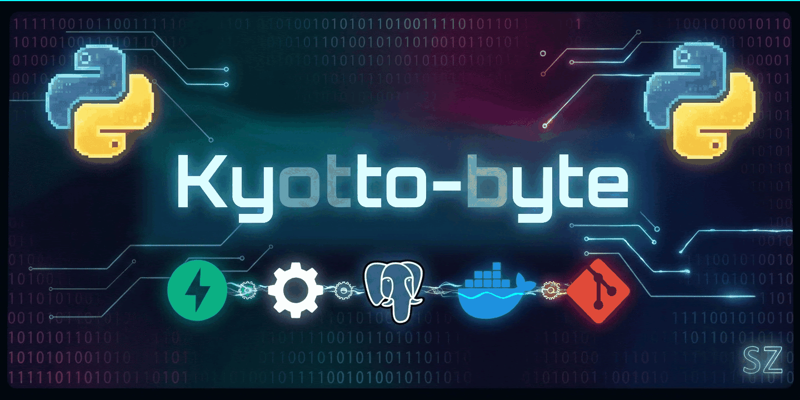

  

---

### 👨‍💻 About Me

*  Learning Python & Backend Development
*  Building Telegram bots, REST APIs, and automation scripts
*  Focused on writing clean, maintainable code

---

### 🛠️ Technologies & Tools

---

### 📊 GitHub Stats

---

### 📬 Connect with Me

